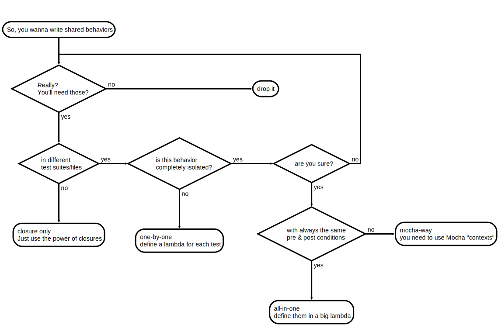

# Shared Behaviors with Mocha

## References

- [Shared Behaviors on Mocha Wiki](https://github.com/mochajs/mocha/wiki/Shared-Behaviours)
- discussion about [Shared Behaviors best practices](https://github.com/open-wc/open-wc/issues/715) in @open-wc
- [Mocha Gitter](https://gitter.im/mochajs/mocha)

### issues

- :coffee: Mocha - [enhancement: new interface to support arrow functions](https://github.com/mochajs/mocha/issues/2657)
- :coffee: Mocha - [Context Variables and Functions](https://github.com/mochajs/mocha/issues/2743)
- :coffee: Mocha - [Idea: scoped globals](https://github.com/mochajs/mocha/issues/2656)
- :x: :coffee: Mocha - [Does Mocha encourage `this` for shared behaviors?](https://github.com/mochajs/mocha/issues/3844)
- :x: :coffee: Mocha - [Enhanced control of test context](https://github.com/mochajs/mocha/issues/3485)
- :x: :coffee: Mocha - [Bind ES5 Arrow function to context](https://github.com/mochajs/mocha/issues/1856)

### PR

- :coffee: Mocha - [initial implementation of "functional" interface](https://github.com/mochajs/mocha/pull/3399) (no update since 2018-12-12)

### projects
  - [mocha-context](https://github.com/eight04/mocha-context)
  - [arrow-mocha](https://github.com/skozin/arrow-mocha) (no update since 2015-04-07)

### And also...

- Jasmine Doc
  - [sharing behaviors tutorial](https://github.com/jasmine/jasmine.github.io/blob/f66bb73533bc027d4f0be99d44f84ecbf614edf4/_tutorials/sharing_behaviors.md)
  - [the `this` keyword](https://jasmine.github.io/tutorials/your_first_suite.html#section-The_%3Ccode%3Ethis%3C/code%3E_keyword)
- What people do
  - https://github.com/GNOME/gjs/commit/f7c4757d6dfd35da49f898a128521d353bb05061
  - https://github.com/meteor/guide/issues/318